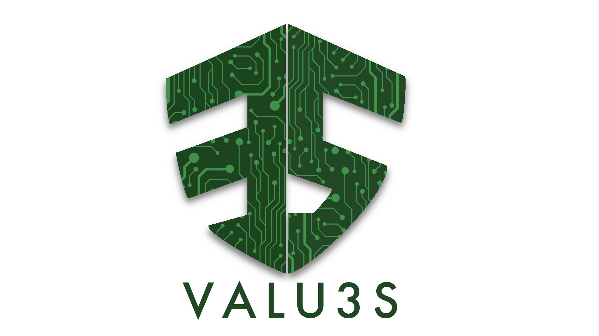

<h2> 1. The Fault Injector </h2>

CubeSatFI is a fault injection platform for CubeSats meant to facilitate the incorporation of this extra step in the Verification and Validation of CubeSats software. CubeSatFI allows the easy definition of fault injection campaigns that emulate the effects of space radiation. SEU are emulated realistically through bit-flip faults injected in the processor registers and in other locations of the CubeSat boards that can be reached by boundary-scan, which is available in CubeSat boards through JTAG Test Access Port. The execution of the fault injection campaigns is controlled by the CubeSatFI platform in a fully automated mode.

Presented in: https://ieeexplore.ieee.org/document/9672584 and http://hdl.handle.net/10316/102168

<h2> 2. Minimum Requirements </h2>

- Windows 10 or above
- Eclipse IDE 2021-03 or above
- JDK 15 or above
- JavaFX 11 or above

<h2> 3. Tool Current Version Targets </h2>

- Arm® Cortex®-M3
- Arm® Cortex®-M4

<h2> 4. Acknowledgments </h2>
European Projects:

Parteners:

